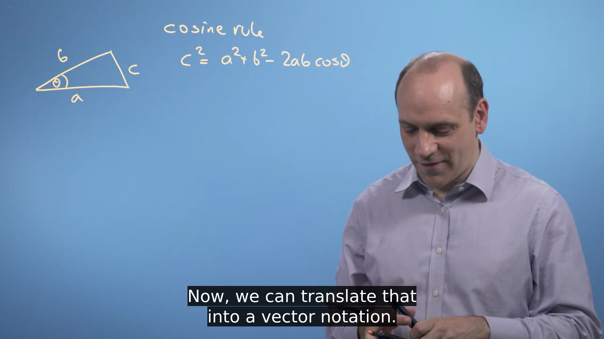

# Linear Algebra

## Week 1

- https://www.3blue1brown.com
- Another type of problem we might be interested in is fitting an equation to some data.
- Solving **simultaneous equations**. 

- In fact, with neural networks and machine learning, we want the computer in effect not only to fit the equation, but to figure out what is the best equation to use. 
- how to find the **optimal value** of the parameters in the equation describing this line. 

### Vectors

Gaussian (Normal) Distribution

- width of sigma
- center of mu
- normalized so that it's area is 1

- in Computer Science, vectors may be represented as lists.
- Vectors can be thought of in a variety of different ways - some geometrically, some algebraically, some numerically.

- One of the tasks of machine learning is to **fit a model to data** in order to represent the underlying distribution.
- **keywords:** model, measured data, parameters.
- One way of fitting is to calculate the "**residuals**", which is the difference between the measured data and the modelled prediction for each histogram bin.
- A better fit would have as much **overlap** as it can, reducing the residuals as much as possible.

- The performance of a model can be quantified in a single number. One measure we can use is the *Sum of Squared Residuals*, SSR.

- The first goal when solving simple simultaneous equations should be to **isolate one of the variables**.
- There is also the substitution method, where we rearrange one of the equations to the form `x=ay+b` or `y=cx+d` and then substitute x or y into the other equation.
- **Vector Addition:** The head-to-tail method of adding vectors involves drawing the first vector on a graph and then placing the tail of each subsequent vector at the head of the previous vector. The **resultant** vector is then drawn from the **tail of the first** vector to the **head of the final** vector.

- vector: a list of attributes

## Week 2

### Vector Modulus

- **Orthogonal Unit Vector**:  A number of vectors that are mutually perpendicular to each other,  meaning they form an angle of 90° with a magnitude of one unit with each other, are called orthogonal unit vectors. The dot product of an orthogonal vector is always zero since Cos90 is zero.
- Pythagoras theorem to find length of hypotenuse.

### Dot Product (inner scalar product; projection product)

- **a**⋅**b**=|**a**||**b**|cos(θ)
- the projection of **a** along **b** is given by |**a**|cos(θ), where θ is the angle between a and b.
- we can say it is **a**⋅**b^** where `b^ = b/|b|` i.e. b-cap is the unit vector in b's direction
- The dot product, or inner product, of two vectors, is **the sum of the products of corresponding components**.
- https://en.wikipedia.org/wiki/Vector_projection

- In Trigonometry, **the law of Cosines,** also known as Cosine Rule or Cosine Formula basically relates the length of the triangle to the cosines of one of its angles. It states that, if the  length of two sides and the angle between them is known for a triangle,  then we can determine the length of the third side. It is given by: 

  c2 = a2 + b2 – 2ab cosγ 

  Where a, b and c are the sides of a triangle and γ is the angle between a and b. See the figure above.

- https://www.youtube.com/watch?v=IyBINDT1ZwQ

- https://www.youtube.com/watch?v=Rw70zkvqEiE

### Changing Basis

- Change of basis is **a technique applied to finite-dimensional vector spaces in order to  rewrite vectors in terms of a different set of basis elements**. It is useful for many types of matrix computations in linear algebra and can be viewed as a type of linear transformation.
- https://www.youtube.com/watch?v=P2LTAUO1TdA
- In mathematics, **a set B of vectors in a vector space V is called a basis if every element of V may be written in a unique way as a finite linear combination of  elements of B**. The coefficients of this linear combination are referred to as components or coordinates of the vector with respect to B.
- basis is a co-ordinate system.
- **Two vectors** are linearly dependent **if and only if they are collinear**, i.e., one is a scalar multiple of the other. Any set containing the  zero vector is linearly dependent. If a subset of { v 1 , v 2 ,..., v k } is linearly dependent, then { v 1 , v 2 ,..., v k } is linearly  dependent as well.

## Week 3

