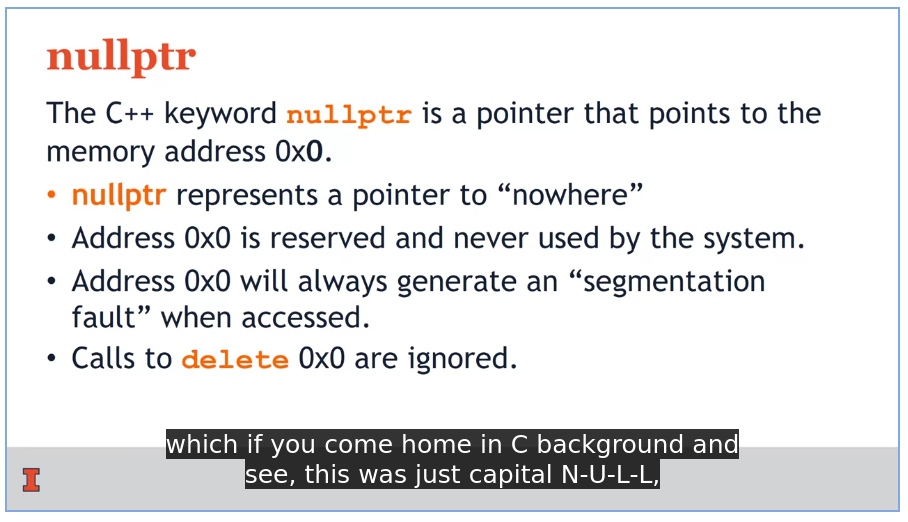

# Object-Oriented Data Structures in C++

> University of Illinois at Urbana-Champaign

## Week 1

### Key Concepts

- C++ language syntax 
- Writing, compiling and debugging code 
- Interactive development environment (IDE) 
- C++ classes 
- Implementation v. header files 
- Public v. private elements of a class 
- Linking to external libraries to access helper routines 
- Namespaces

### About C++

- **strongly typed**: every variable has a type, name, value, and location in memory
- variables are of 2 types: `primitive` and `user-defined`


- :warning: The Standard Template Library in C++ (with the "std" namespace) **may be a standard library**, but the published standard only describes how it should work. The professor refers to it as "user-defined" because it **still needs to be implemented** by the creators of your operating system and compiler. Although it is standardized, it is built in the same way that you can define your own complex types and libraries.

- Every C++ program has a standard starting point: the  `main()` function.
- `int main()` must return integer values. By convention, `0 = success` and `non-zero = error `
- `std::cout` means output to console. `<<` shows concatenation.

### Linux-compatible system

- Not every operating system has the same collection of system functions and command-line environment, so in practice developing in C++ can be somewhat different depending on which operating system you are targeting. We'll use Linux.
- GNU/Linux: ersions, called "distributions"
- **Terminal/Shell/Command prompt**: They all refer to the text-based system management window that is used for typing system commands.
- Bash: This is one of the most common **text-based shell environments**.
- AWS Cloud9: This is a **web-based Linux terminal** you can set up, that is hosted on Amazon's AWS service. This is a good backup option for some users.
- The "sudo" part means this command will temporarily be executed with system administrator permissions. (The "su" part comes from **"superuser"**, which means system administrator. Other terms for this are "root user" or simply "administrator".) 
- A **symlink** (also called a **symbolic link**) is a type of file in Linux that  points to another file or a folder on your computer. Symlinks are  similar to shortcuts in Windows.
- create a symlink as: `ln -s <path to the file/folder to be linked> <the path of the link to be created>`
- https://www.freecodecamp.org/news/symlink-tutorial-in-linux-how-to-create-and-remove-a-symbolic-link/

### What is Git?

- "version control system"
- sites like GitHub offer hosting services for projects managed by the "git" software.
- https://github.com/wadefagen/coursera
- You can use any of these editors for *editing your code text*, but for actually building (compiling), you need to use the **makefiles** that we provide. These are special scripts designed to work with the terminal program "Make", which is executed in the Bash terminal simply by typing **make**.
- https://opensource.com/article/18/8/what-how-makefile

### C++ Classes (User-defined types)

- classes encapsulate data and associated functionality into an object


- **protection levels** (public and private): decide the access that client code has to the member data or functionality
- private data and functions are only accessible inside the class
- **private** member variables have an **underscore** at the end of their name, like `length_`

- C++ **header file** `.h` defines the interface of the class whereas `.cpp` defines implementation
- `.h` contains **declaration** of all member variables and declaration of all member functions
- the `.cpp` file contains all the logic to implement our class
- `.h` files begin with `# pragma once` so that the class's definition is compiled only once
- class declaration also ends in a semicolon, just like primitive data types


### STD (Standard Library) vs STL

<table><thead><tr><th>STD</th><th>STL</th></tr></thead><tbody><tr><td>Std stands for standard</td><td>Stl stands for standard template library</td></tr><tr><td>Std falls under the standard C++ Library</td><td>Stl is a subset of std&nbsp;</td></tr><tr><td>All libraries fall under std.</td><td><p>There are 4 categories of stl:</p><ul><li>Algorithms</li><li>Functions.</li><li>Iterators</li><li>Containers.</li></ul></td></tr><tr><td>Space resolution operator is used(::)</td><td>No operator is used</td></tr><tr><td><p><strong>Examples:</strong>&nbsp;</p><p>cin, cout under iostream header</p></td><td><p><strong>Example:</strong></p><p>sort(),lower_bound().</p></td></tr></tbody></table>

- iostream header includes operations for reading/writing to files and console `std::cout`
- header files must be included as `#include <iostream>`


- A **namespace** is **a declarative region that provides a scope to the identifiers (the names of types, functions, variables, etc) inside it**. Namespaces are used to organize code into logical groups and to prevent name collisions that can occur especially when your code base includes  multiple libraries.


- do the above `namespace{class...}` enclosing in both `.h` and `.cpp`
- Which keyword is used to indicate which namespace(s) to search to find classes and variables when they are referenced throughout the rest of the program? `using`
- Which C++ directive is used to insert the contents of another file at the current location while processing the current file? `#include`

## Week 2

### Key Concepts

- Pointers and dereferencing 
- Local (stack) memory 
- Allocated (heap) memory

### Variables and Memory Addresses in C++

- has name, type, value, a location in memory
- `int primeNum = 7;`
- `&` operator returns the memory address in hexadecimal system
- `$./addressOf` 
  `Value: 7`
  `Address: 0x7ffd0a967604`
- stack memory grows from high to low address (i.e. it grows *towards 0*)


- `./foo` 
   `num in main(): 7`
  `&num in main(): 0x7ffda969e264`
   `x in foo(): 42`
  `&x in foo(): 0x7ffda969e244`

### Pointers

- a pointer is a variable that stores the memory address of the data
- defined by adding a `*` to the **type of** the variable
- `int* p = &num;`
- dereference operator: to get the data of the pointer variable's operand address
- dereferencing of memory address is done by adding `*` to the **variable name**
- `*p = 42;`

### Heap Memory

- memory needed to exist for longer than the lifecycle of the function
- `new` operator is the onlyword which can allocate heap


- memory only re-claimed when `delete` is used


- heap memory starts from smaller numbers and grows upwards

- so value of heap memory address is smaller than stack address

### NULL pointer

- segmentation fault

- saves us from dangling pointers

- ```c++
  delete c;
  c = nullptr;
  ```

- after the line "delete c;" the pointer c still stores the address of the deleted variable, which is no longer valid to dereference and is therefore dangerous.



- arrow operator in Classes


### **heap puzzles**


- **new** keyword tells us some of it is gonna be on the heap
- `&y` gives us a **reference variable** (not reference pointer) which aliases a piece of memory:


- in the above, `cout << *y << endl;` gives an error because it can not be dereferenced


- arrays in heap memory - `new [size]; delete [];` - here the array brackets denote arrays


### C++ header file syntax

- **.h** files are "header files". These usually have definitions of objects and declarations of global functions. Recently, some people name header files with a ".hpp" suffix instead.
- **.cpp** files are often called the "implementation files," or simply the "source files". This is where most function definitions and main program logic go.


- A more detailed primer on the casting topic: http://www.cplusplus.com/doc/tutorial/typecasting/
- In-depth documentation: https://en.cppreference.com/w/cpp/language/implicit_conversion

## Week 3

### Key Concepts

- lifecycle of a C++ object
- Constructors and destructors 

- Methods and operators 
- Access through pointers and references

### Constructors are not unique


### Copy constructor


> A constructor's job is to actually create the object itself, and not just copy things between two existing objects.

### Assignment Operator


### Variable Storage


### Class Destructor


- The destructors aren't called at compile time, but rather during runtime.


- On Linux, if you dereference an address that you shouldn't, this is often called "segmentation fault," or "segfault."
- it's a good practice to set a pointer to nullptr if you aren't setting it to any other value immediately.
- **for (** ***temporary variable declaration*** **:** ***container*** **) {** ***loop body*** **}**

## Week 4

### Key Concepts

- Object-oriented design 
- Templates 
- Class hierarchies and inheritance
- tower of Hanoi

### Template Types


