# Ordered Data Structures

## Arrays

- only store similar data types
- `size of array = size of data item * no. of items`
- pointer to array = array's zeroth index

## Linked Memory

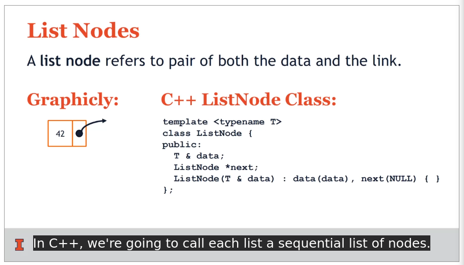

- `node = [data | pointer to next]`
- head pointer stores link to beginning of list
- pointer to nullptr marks the end

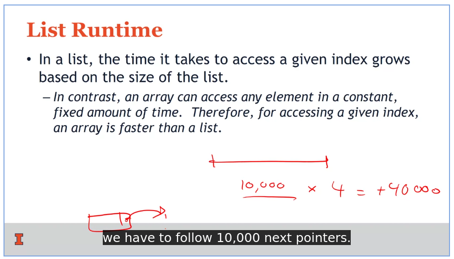

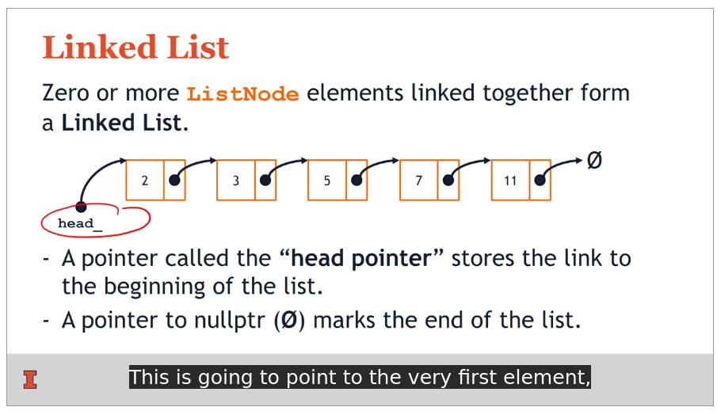

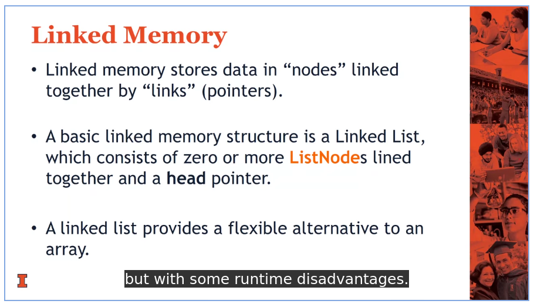

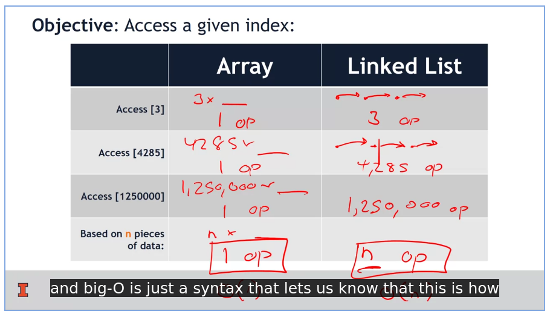

 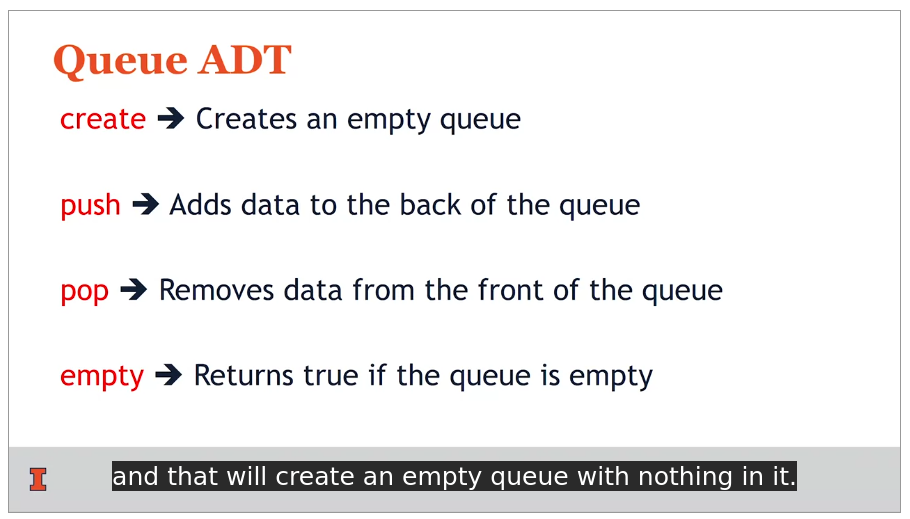

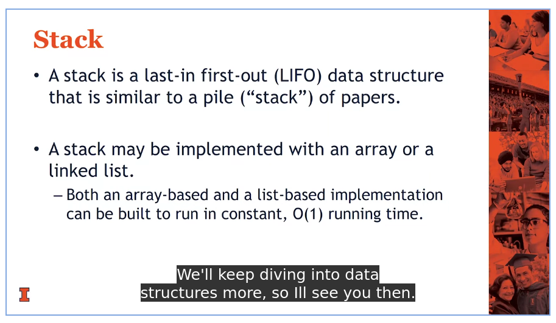

## Tree Terminology

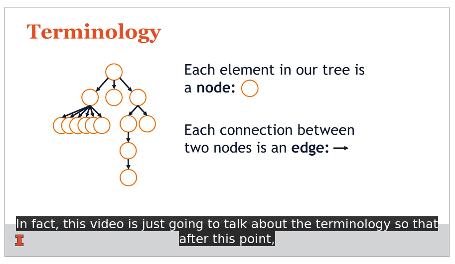

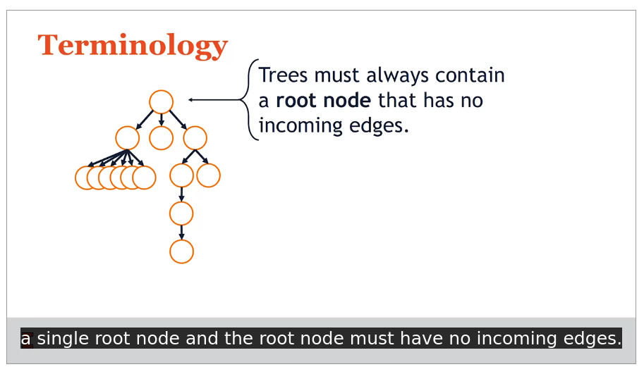

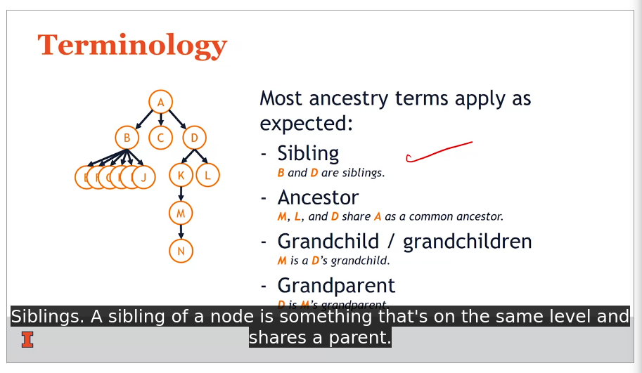

## Binary Trees

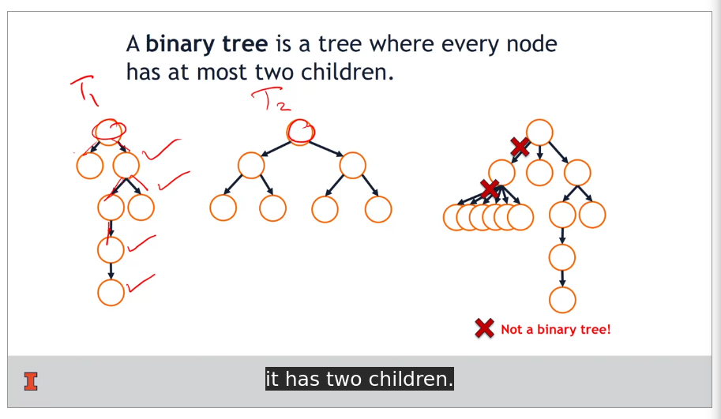

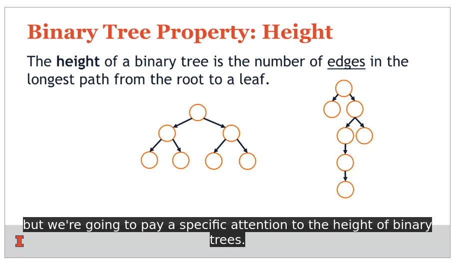

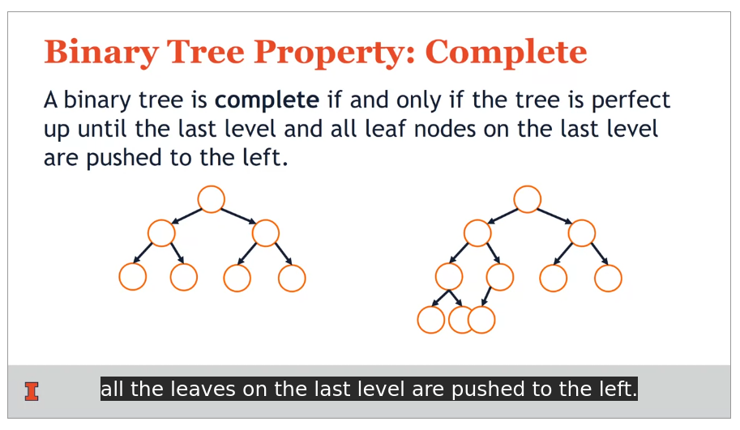

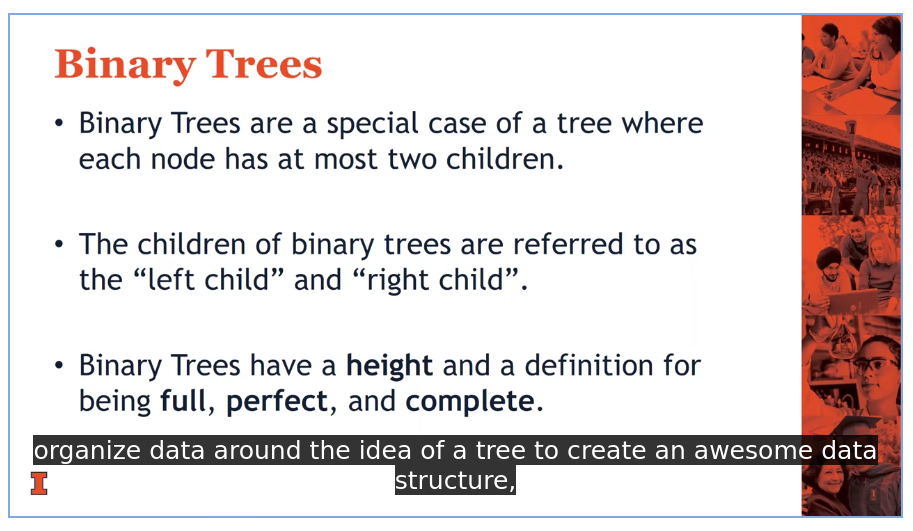

## Tree Traversals

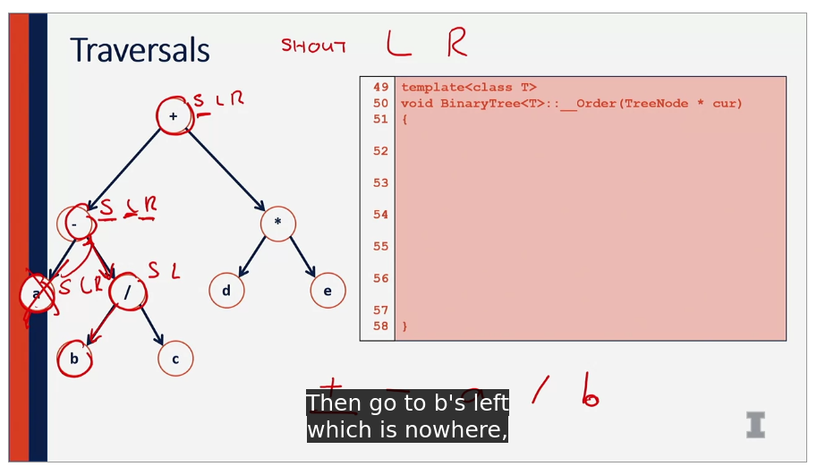

- pre-order (because we shout-out current node first, then move)
- `shout-out > left > right`

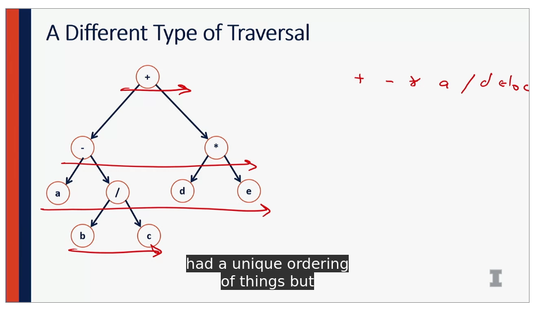

- level order traversal

## Binary Search Tree

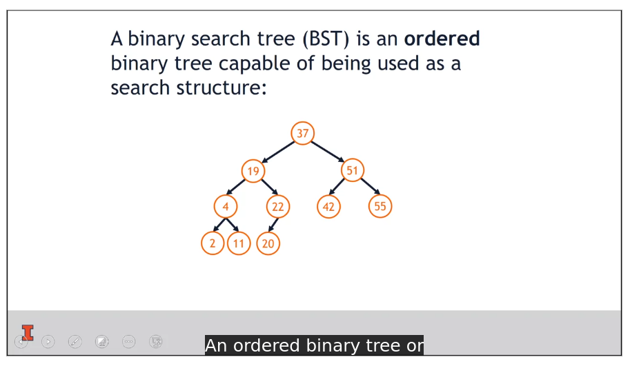

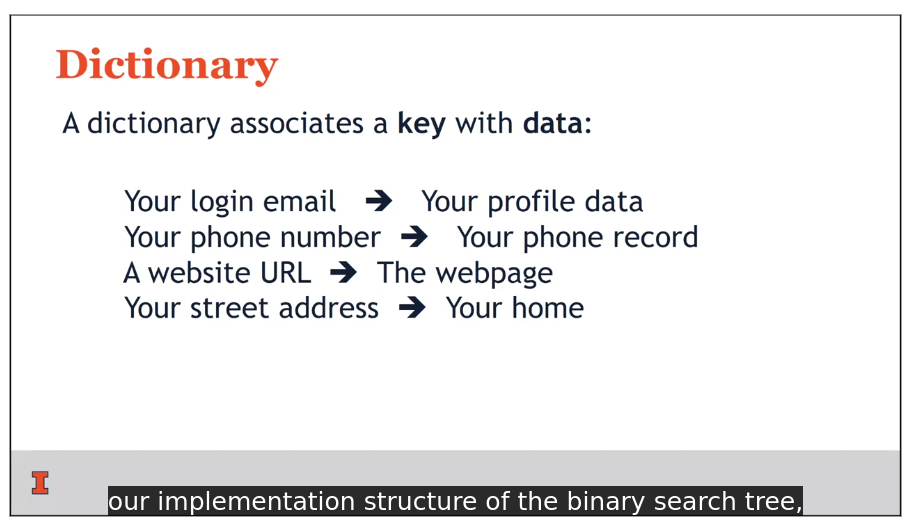

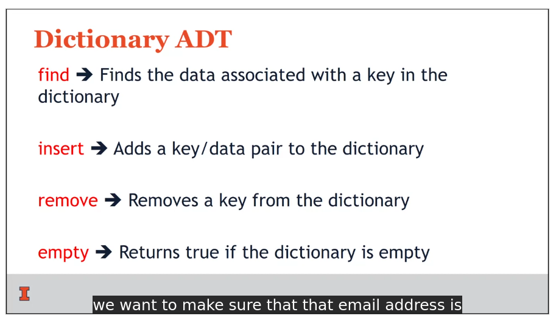

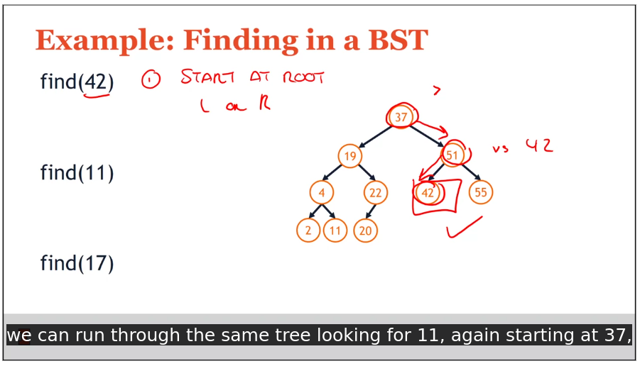

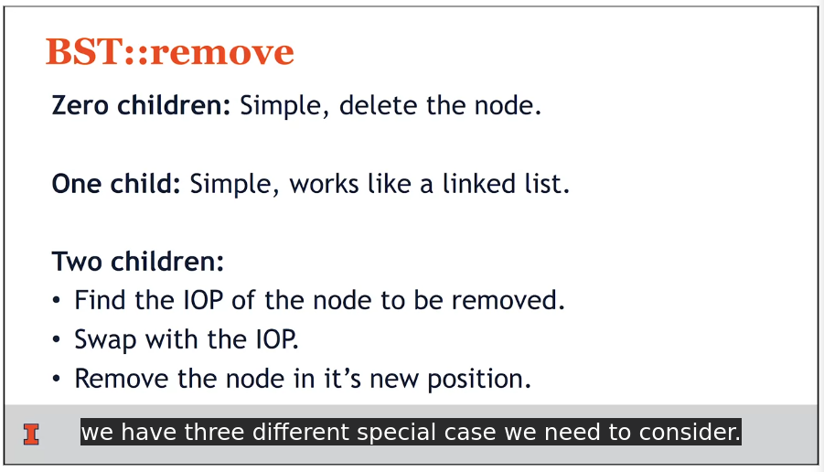

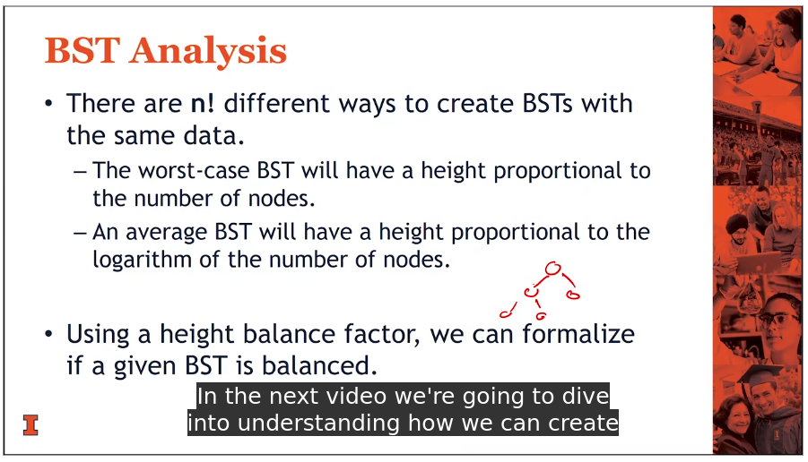

